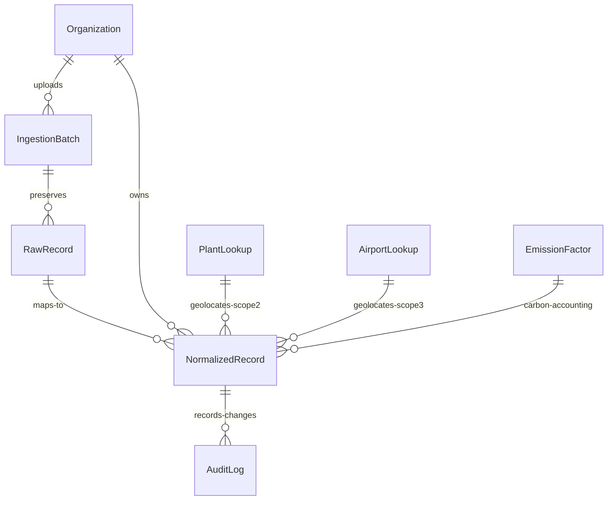

# Data Model Documentation (`MODEL.md`)

This document outlines the database schema designed for the Breathe ESG Ingestion and Normalization prototype. It details the reasoning behind key architectural choices to guarantee multi-tenancy, source-of-truth integrity, pro-rata tracking, unit standardisation, and a completely airtight audit trail for compliance auditing.

---

## 1. Entity Relationship Diagram (ERD)

---

## 2. Model Breakdown & Schema Fields

### A. Organization (Tenant)
Multi-tenancy is implemented at the core. Every record in our system belongs to an `Organization`. Row-level filtering by `organization_id` ensures logical data separation.
*   `id` (BigInt, PK)
*   `name` (Varchar 255): Name of the client company (e.g., "Acme Corp").
*   `created_at` (DateTime, auto-add)

### B. IngestionBatch
Tracks the upload sessions. It preserves who uploaded what document, which system parsed it, and whether the processing succeeded.
*   `id` (BigInt, PK)
*   `organization_id` (ForeignKey -> Organization): Enables tenant-level extraction history.
*   `source_type` (Varchar 50): Restricts to `SAP`, `UTILITY`, or `TRAVEL`.
*   `file_name` (Varchar 255): Store the original filename (e.g. `sap_extract_q2_2026.csv`).
*   `uploaded_by` (Varchar 100): Analyst who triggered the upload.
*   `uploaded_at` (DateTime, auto-add)
*   `status` (Varchar 50): `PROCESSING`, `COMPLETED`, or `FAILED`.

### C. RawRecord (Preserving Source of Truth)
> [!IMPORTANT]
> **Source-of-Truth Protection**: To satisfy rigorous auditing criteria, we *never* modify the raw payload. The `RawRecord` stores the exact raw string or JSON row in a `JSONField` exactly as it came from SAP, the utility portal, or Concur. If the carbon science or emission factors change next year, we can re-normalize and re-calculate everything perfectly without asking the client to re-upload.
*   `id` (BigInt, PK)
*   `batch_id` (ForeignKey -> IngestionBatch)
*   `row_index` (Integer): Index of the row in the uploaded file (crucial for linking error messages to exact spreadsheet lines).
*   `raw_payload` (JSONField): The exact parsed row values (e.g., `{"Werk": "PL001", "Menge": "-150"}`).
*   `created_at` (DateTime, auto-add)

### D. NormalizedRecord
Represents the standardized, structured activity line after mapping, calendarization, unit translation, and emission calculations.
*   `id` (BigInt, PK)
*   `raw_record_id` (ForeignKey -> RawRecord, nullable): Nullable to survive if a batch is archived, but links back to the raw source row.
*   `organization_id` (ForeignKey -> Organization)
*   `scope` (Integer): `1` (Scope 1 direct fuels), `2` (Scope 2 electricity), or `3` (Scope 3 business travel).
*   `category` (Varchar 50): `fuel`, `electricity`, `flight`, `hotel`, `car`.
*   `activity_date` (Date): The normalized date (pro-rata calendar dates for utilities).
*   `original_quantity` (Varchar 100) & `original_unit` (Varchar 100): The messy raw inputs.
*   `normalized_quantity` (Float) & `normalized_unit` (Varchar 50): The cleaned, standardized values (e.g., Liters, kWh, Kilometers).
*   `calculated_emissions` (Float): Final carbon footprint in **kg CO2e** (emissions product).
*   `status` (Varchar 20): `PENDING` (needs review), `APPROVED` (signed off), `REJECTED`, or `FLAGGED` (failed automated validations).
*   `validation_flags` (JSONField): Lists all detected issues (e.g., `["UNKNOWN_PLANT", "METER_READ_GAP"]`).
*   `is_locked` (Boolean): Default `False`. Once signed off, this flag becomes `True` preventing any edits.

### E. AuditLog (The Airtight Compliance Trail)
> [!WARNING]
> **Compliance Transparency**: Every single human override, bulk approval, or flag note writes an immutable entry in the `AuditLog` table. It captures the analyst's identity, the action type, the exact old values side-by-side with new values, and a mandatory text reason.
*   `id` (BigInt, PK)
*   `normalized_record_id` (ForeignKey -> NormalizedRecord)
*   `action_by` (Varchar 100): The analyst name.
*   `action_type` (Varchar 50): `APPROVE`, `FLAG`, `EDIT`, `REJECT`.
*   `old_values` (JSONField): Capture state before action.
*   `new_values` (JSONField): Capture state after action.
*   `reason` (TextField): Mandatory explanation of why the change was made.
*   `timestamp` (DateTime, auto-add)

### F. Lookups: PlantLookup, AirportLookup & EmissionFactor
*   **`PlantLookup`**: Resolves plant code codes (e.g. `PL002` -> `Stuttgart Assembly, Germany`) and maps them to grid carbon zones (`DE` grid vs `ERCT` Texas eGRID zone) for localized Scope 2 footprinting.
*   **`AirportLookup`**: Stores latitude & longitude coordinates for standard IATA codes (e.g. `JFK`, `LHR`) to dynamically compute Great Circle passenger flight distances.
*   **`EmissionFactor`**: The reference library mapping activity categories (fuel, electricity, flights, hotels) to localized CO2e constants (e.g., `2.68 kg/L` for diesel or `12.2 kg/room-night` for hotels in the UK).

---

## 3. Key Design Tradeoffs

1.  **SQLite for the Prototype**: We opted for standard SQLite. It runs natively without requiring external server dependencies like PostgreSQL, making the prototype instantly portable and deployable on providers like Render/Railway with zero friction. For production, this easily swaps to Postgres.
2.  **Normalized Split for Pro-Rata Cycles**: When a utility bill spans across April 15 - May 14, the parser generates *two separate* rows in the `NormalizedRecord` table (proportionally splitting the kWh usage). They both link back to the *same* `RawRecord` row. This allows perfect month-by-month financial and carbon reporting, preserving trace-ability to the original utility invoice.
3.  **JSON for Validation Flags**: Rather than separate tables for warning logs, we store them as a JSON list in `validation_flags`. This makes it simple to add new automated checks (e.g., `NEGATIVE_QUANTITY`, `OVERLAPPING_BILL`) without executing database migrations, keeping the schema clean and fast.
